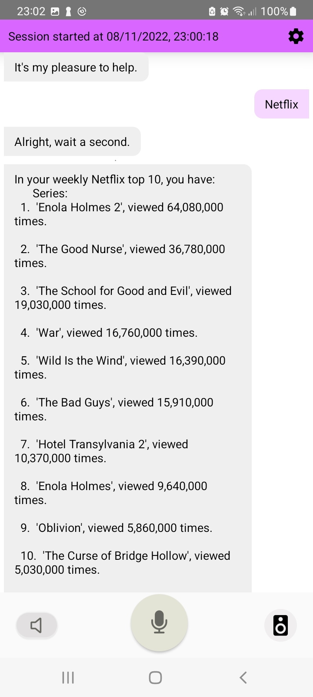
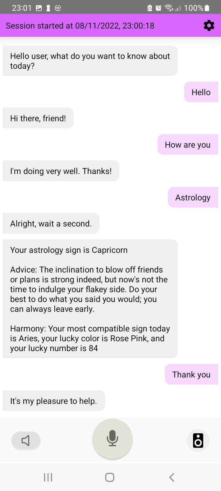
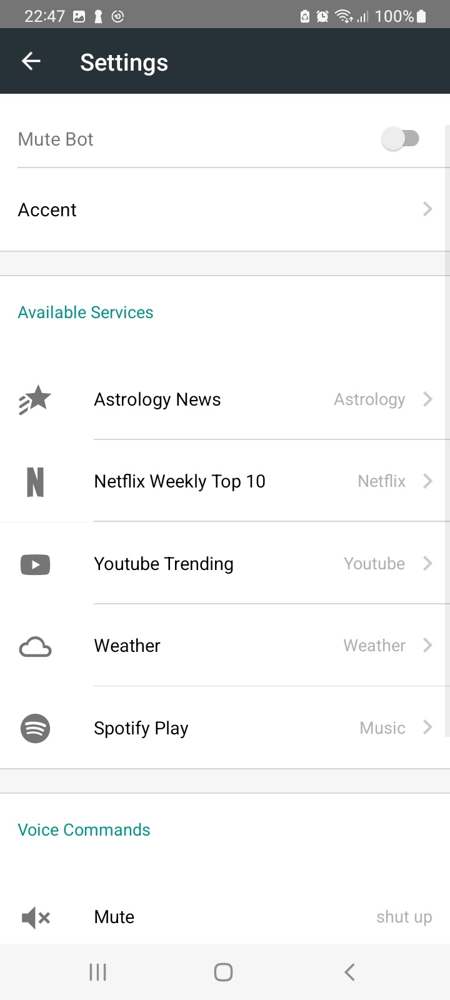
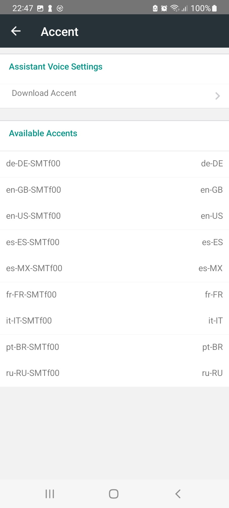

# Daily voice summary

First time using React Native. It was a bit overwhelming especially the differences between functional and class components, different ways of implementing things, the amazing hooks...

Dead tired. This was actually made in 7 days for a competition, imagine that, and I never used React Native before.

It's basically a voice assistant. Well, let's say it's an API voice assistant. You say a specific phrase and then it'll communicate with some specific API depending on this phrase, then returns a formatted voice message, was originally intended to reduce your daily scrolling in youtube and stuff.

The voice assistant was created using DialogFlow. Though, I didn't dwelve too much into that, simply because I don't have the time to learn it. I just used it for casual dialogue admittedly.

I also used too much time going on about basic things and abstract vague damned errors, and only implemented Astrology Sign, Netflix top movies and series, and lastly a Youtube Trending API. You can also see Spotify UI lying around. 

These APIs were implemented thanks to RapidAPIs.

I really want to expand this project more, it's actually really interesting. I especially discovered that there's a music agent in DialogFlow, too late sadly. I also had ideas about the Weather API. Well anyway.

Here are a few pictures:

<table cellpadding="0">
  <tr style="padding: 0">
    <!-- GitHub Stats Card -->  
    <td valign="top">
         
    </td>
    <td valign="top">
         
     </td>
     <td valign="top">
         
     </td>
  </tr>
</table>

<table cellpadding="0">
  <tr style="padding: 0">
    <!-- GitHub Stats Card -->  
    <td valign="top">
         
    </td>
    <td valign="top">
         
     </td>
  </tr>
</table>

# Voice Commands: 

- Shut Up: will mute bot
- Speak: Unmute bot
- Summary: Gives an overall summary of all your APIs output.
- Settings: Opens settings menu

# Services available:

- [X] Astrology News (by sign)
- [X] Netflix Top Series/Movies (both or only one of them)
- [X] Youtube Trending (By country, by category (gaming, music, movies))
- [ ] Weather 
- [ ] Spotify

You can select a phrase to trigger which service (maybe mutiple at same time).

# Other fonctionalities:

Other than voice messaging for your API outputs, you can set specific API parameters from the Settings menu, set which will summarize on 'Summary'. I also used quite a bit of time to make it easier to add new APIs for possible future usage. 

Note to self: You start your search in the env folder in src. Also please move the environement variables and API authentification tokens to the server-side, any user can see them!

Alright. This is an imperfect project. But I had fun noneless, so thanks for the opportunity (to the competition administration)!

